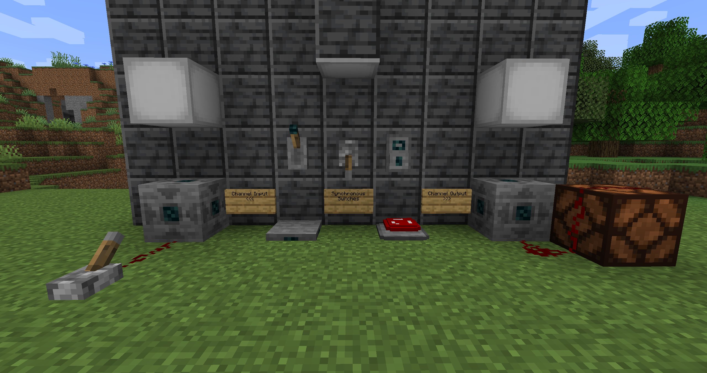
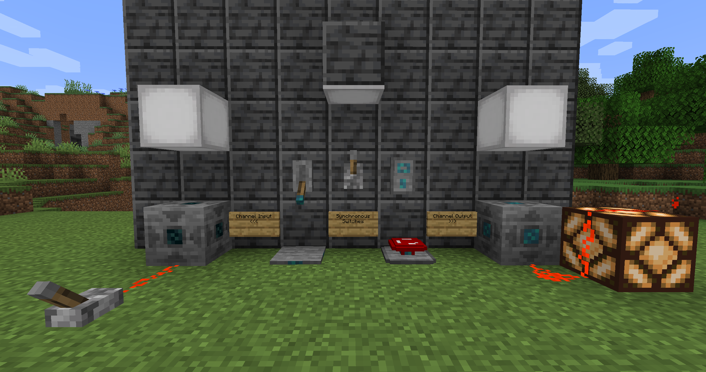

# Synchronous Switches
This mod adds "Synchronous Switches" which can be linked together via a channel. When the state of a switch is toggled then any other switches that are on the same channel will update their output to match that state. In addition to the switches, there are channel input/output blocks and lights.

## Features
### Adds
* Synchronous Switch (Several Styles)
* Channel Output Block
* Channel Input Block
* Channel Light Block/Panel

### Use
* Set Channel by clicking a named piece of paper on the switch/block
* Copy channel by shift right clicking a channel item on an existing switch/block
* Clear channel by shift right clicking in the air
* Clear channel by setting channel to "None" with a named piece of paper
* Redact/Unredact switch by right clicking ink on the switch/block
* Mute/Unmute switch by right clicking white wool on the switch/block
* Check if the channel status by shift right clicking with an empty hand
* Right click with a switch in your main hand to toggle the channel active without having the switch placed

### Images

## Credits
* Riewest14
* LogicEngineer